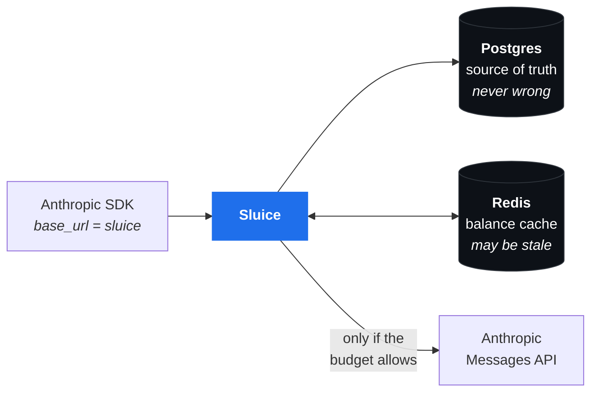

# Sluice

**A billing gateway for LLM APIs.** Meters every call against a double-entry ledger,
and refuses it with `402` before it leaves when the money is gone.

```python
client = Anthropic(base_url="https://sluice.internal", api_key="sk-sluice-...")
```

That is the entire integration. No SDK fork, no wrapper, no change at the call site.

<br>

| | |
| --- | --- |
| **Stack** | Java 21 · Spring Boot 3.5 · Postgres · Redis · Flyway |
| **Tests** | 54, against a real embedded Postgres, no Docker needed |
| **Overhead** | p50 3–5 ms · p99 8–11 ms before the provider is called |
| **Design docs** | [HLD](docs/HLD.md) · [LLD](docs/LLD.md) · [Schema](docs/SCHEMA.md) |

---

## Why this exists

Provider consoles already tell you **what you spent**. Workspaces, per-workspace keys
and cost reports cover attribution well, and if all you need is a chart of spend per
team, you do not need this.

Two things they do not do:

**1. Stop a call.** Rate limits cap tokens per minute, not dollars per month. An agent
stuck in a loop at 2am gets throttled, not stopped — and the cost report tells you
about it in the morning. Sluice refuses the call at `$5.01` and never contacts the
provider.

**2. Produce numbers you can invoice from.** A spend counter is fine for a dashboard
and useless for a bill. Charging someone else for AI usage needs reservations (so ten
concurrent calls cannot collectively blow the limit), idempotency (so a retry is not a
double charge), and books that reconcile under audit.

So this is for whoever has to **charge someone else** for LLM spend — a platform team
doing internal chargeback, a SaaS passing AI costs to customers, an agency billing
clients. If you only need to watch the number, use your provider's console.

**Sluice never stores prompts or completions.** It counts tokens and charges for them.
That is a deliberate non-goal, and it keeps the security story trivial.

---

## How it works



The core problem: **you cannot know what a call costs until it finishes, but you have
to decide whether to allow it before it starts.**

So Sluice reserves a pessimistic estimate up front, runs the call, then replaces the
estimate with the truth — the same mechanism a fuel pump uses when it authorises $100
on your card and settles $43.

```
   ┌────────────────────────────────────────────────────────────────┐
   │  POST /v1/messages                                             │
   │                                                                │
   │  1. AUTH       virtual key ─▶ account ─▶ ancestor chain        │
   │  2. ESTIMATE   input tokens + max_tokens × model rate          │
   │  3. PREFLIGHT  cached balance                        ~1 µs     │
   │  4. RESERVE    one Postgres transaction:                       │
   │                  SELECT … FOR UPDATE over the chain            │
   │                  budget + balance check  ← the authority       │
   │                  write the HOLD entry                          │
   │                    └─ refused ─▶ 402, provider never called    │
   │  5. PROXY      relay bytes, tapping the usage block            │
   │  6. SETTLE     book the real cost, return the remainder        │
   └────────────────────────────────────────────────────────────────┘
```

Step 4 is the product. Everything else is plumbing around it.

→ Full sequence diagrams and failure analysis in **[HLD.md](docs/HLD.md)**.

---

## The ledger

### One sign convention

Balance is **`SUM(debits) − SUM(credits)`** for *every* account — no per-type
exceptions. Two consequences: the whole ledger sums to exactly zero at all times, and
`available` is a single number rather than "balance minus open holds".

Four ledger accounts per customer account:

| | |
| --- | --- |
| `credits:<id>` | Spendable prepaid pot |
| `holds:<id>` | Reserved for calls in flight |
| `usage:<id>` | Lifetime consumption |
| `equity:funding` | Contra account money enters through |

### The cycle

A $0.05 estimate that turns out to cost $0.02:

```
DEPOSIT  $25    DEBIT  credits  25.00    CREDIT equity  25.00

HOLD     $0.05  DEBIT  holds     0.05    CREDIT credits  0.05
                └─ pessimistic on purpose: every input token priced as
                   uncached, plus a full max_tokens of output

  ...the call runs, tokens counted on the way through...

SETTLE   $0.02  CREDIT holds     0.05    ← reservation unwound in full
                DEBIT  usage     0.02    ← real cost booked
                DEBIT  credits   0.03    ← unused remainder returned

RELEASE         DEBIT  credits   0.05    CREDIT holds    0.05
                └─ call failed, provider refused, or the hold expired
```

Every entry balances. Every step is idempotent on the client's request id — a retried
settle is a no-op, not a second charge.

### The invariant is enforced by the database

```sql
create constraint trigger posting_balanced
    after insert or update or delete on posting
    deferrable initially deferred        -- checked at COMMIT
    for each row execute function assert_entry_balanced();
```

Deferring to commit time makes a multi-row entry legal mid-transaction while making an
unbalanced entry impossible to commit — **through any code path**, including raw SQL
that bypasses the application. One test opens a transaction, writes a one-sided
posting by hand, and asserts the commit fails.

Same idea for idempotency: `journal_entry.idempotency_key UNIQUE`. The database
prevents double-posting; the application just handles the conflict.

→ Every table, index and constraint in **[SCHEMA.md](docs/SCHEMA.md)**.

### Money is stored in micros

**1 unit = 1,000,000 micros.** Cents are too coarse: a 300-token call on a $3/MTok
model costs $0.0009, which rounds to zero. Micros give six decimals, and a signed
`BIGINT` still spans ~$9.2 trillion. All arithmetic is exact integer math with one
half-up division at the end. No floating point touches money anywhere.

### Who pays, and what caps

Two independent constraints, either of which can refuse:

**Balance — exactly one payer.** The nearest account in the chain that has ever been
funded, walking up from the key's own account. Fund the org and every project draws
from one pot; fund a project and it gets a ring-fenced one.

**Budget — every budgeted ancestor.** Each caps spend across its *whole subtree* for
the period. Independent of funding, so an unfunded team can run on a pure budget.

**Neither?** Refused. An account nobody can stop spending is the exact failure this
gateway exists to prevent. Override with `sluice.budget.allow-unmetered=true`.

---

## Running it

```bash
export ANTHROPIC_API_KEY=sk-ant-...
docker compose up --build -d
./scripts/seed.sh
```

`seed.sh` creates an org and a team, credits it $25, sets a $5 monthly hard budget,
issues a virtual key, and prints a ready-to-run `curl`. Under five minutes from clone
to a metered call.

**Without Docker** — needs a Postgres, Redis optional:

```bash
SLUICE_DB_URL=jdbc:postgresql://localhost:5432/sluice \
SLUICE_ADMIN_TOKEN=dev-admin-token \
ANTHROPIC_API_KEY=sk-ant-... \
./mvnw spring-boot:run
```

Flyway builds the schema and seeds the rate table on first start. With
`sluice.cache.enabled=false` Sluice runs single-node with an in-process cache and no
Redis at all.

**Tests** — `./mvnw test`. No Docker required.

---

## API

### Proxy

```
POST /v1/messages          Anthropic-compatible, streaming and non-streaming
```

Bodies are relayed **unmodified**. The virtual key is stripped and the real provider
key substituted; every other header the provider understands is forwarded, so features
Sluice has never heard of keep working.

Added response headers:

| Header | Meaning |
| --- | --- |
| `x-sluice-request-id` | Idempotency key for this call's hold/settle cycle |
| `x-sluice-overhead-ms` | Gateway time before the provider was called |
| `x-sluice-cost` | What this call was charged (non-streaming) |
| `x-sluice-input-tokens` / `x-sluice-output-tokens` | The provider's own counts |

Send your own `x-sluice-request-id` (or `idempotency-key`) for exactly-once billing
across retries. Replaying an id already processed returns `409` — Sluice does not store
response bodies, so it cannot replay the original answer, and re-running the call would
spend money you did not ask to spend twice.

### Admin

All under `Authorization: Bearer $SLUICE_ADMIN_TOKEN`. An empty token disables
`/admin/**` outright rather than leaving it unauthenticated.

```
POST   /admin/accounts                        create an org / team / project
GET    /admin/accounts/{id}
POST   /admin/accounts/{id}/keys              issue a virtual key
GET    /admin/accounts/{id}/keys
DELETE /admin/keys/{keyId}                    revoke
POST   /admin/accounts/{id}/credits           prepaid top-up (idempotent on reference)
PUT    /admin/accounts/{id}/budget            set a period limit
GET    /admin/accounts/{id}/budget
GET    /admin/accounts/{id}/balance
GET    /admin/accounts/{id}/usage?from=&to=   rolled up over the subtree
GET    /admin/accounts/{id}/usage.csv         flat export for reconciliation
GET    /admin/accounts/{id}/ledger            raw journal, for audit
GET    /admin/ledger/integrity                both numbers must be zero, always
```

### Refusals are debuggable from the client

```json
{
  "type": "error",
  "error": {
    "type": "payment_required",
    "message": "MONTHLY budget exceeded on account 'platform': limit 5.000000 USD, 5.000000 USD already committed, 0.030000 USD requested",
    "sluice": {
      "reason": "budget_exceeded",
      "account_id": "…", "account_name": "platform",
      "period": "MONTHLY",
      "limit": "5.000000", "committed": "5.000000", "requested": "0.030000",
      "currency": "USD"
    }
  }
}
```

Note `account_name` — the account that tripped is not necessarily the one your key
belongs to. An org-level budget refusing a project's call says so.

---

## Measured numbers

From `GatewayOverheadTest`, on a 4-core container against embedded Postgres — modest
hardware, so treat these as an upper bound:

| | p50 | p95 | p99 |
| --- | --- | --- | --- |
| Gateway overhead before the provider call | 3–5 ms | 6–7 ms | 8–11 ms |
| Pre-flight budget check (cache path) | < 0.001 ms | — | < 0.001 ms |

Ranges rather than single figures, because they move by a millisecond or two between
runs. Run `./mvnw test -Dtest=GatewayOverheadTest` for your own.

"Gateway overhead" is auth + parse + estimate + budget check + the hold write, measured
server-side and reported on `x-sluice-overhead-ms`.

**Being straight about the cache.** The budget-check figure is the in-process cache used
in tests. Its value is on the *refusal* path — a runaway agent's thousandth rejected
call costs a cache read, not a database round trip. The *accept* path still writes the
hold to Postgres synchronously, so Redis does not speed it up today. Moving settlement
behind an outbox is the next step, and is worth doing when load testing shows it
matters, not before.

`loadtest/budget-check.k6.js` drives both paths against a running stack:

```bash
k6 run -e SLUICE_URL=http://localhost:8080 \
       -e REFUSED_KEY=sk-sluice-... -e FUNDED_KEY=sk-sluice-... \
       loadtest/budget-check.k6.js
```

---

## Design decisions worth arguing about

**Token counts come from the provider, not from us.** Counting streamed output locally
drifts from the provider's number — and the provider's number is what we get invoiced
for. So Sluice trusts the `usage` block: `message_start` for input (with the cache
read/write split), `message_delta` for the final output count. The cost is that a call
can overrun its hold; settlement charges the real figure rather than capping at the
reservation, driving the balance negative if it must. Under-reporting spend is the
worse failure.

**A mid-stream disconnect cancels upstream.** When the client hangs up, Sluice stops
reading, which closes the provider connection and stops generation. Draining it instead
would keep the meter running on tokens nobody will ever see. The call settles on what
was delivered, flagged `partial`.

**Settlement is interrupt-proof.** A client disconnect makes the servlet container
interrupt the request thread, and JDBC over NIO closes its socket the instant it
touches an interrupted thread. Without clearing that flag first, the disconnect that
should settle the call silently fails to bill it. Found by the disconnect test — reading
the code would never have surfaced it.

**Locks are taken in sorted order.** Two requests over overlapping account chains would
otherwise deadlock. A global ordering makes the cycle impossible.

**Holds expire.** A client that dies between hold and settle would reserve money
forever. A sweeper releases holds past `expires_at`; releasing is the safe direction to
be wrong in, so the TTL is generous.

**Rates are versioned in time.** `model_rate` is keyed on `(model, effective_from)`.
Never update a row — insert a new one — so historical usage stays reproducible. FX
rates are pinned on the journal entry at transaction time for the same reason.

---

## Capability matrix

| | Status | Proven by |
| --- | --- | --- |
| Anthropic-compatible passthrough | ✅ | `ProxyIntegrationTest` — verbatim relay, virtual key never forwarded |
| Double-entry ledger | ✅ | `LedgerConcurrencyTest` — 1,000 concurrent transfers, invariant holds |
| Hold / settle / release | ✅ | `HoldSettleTest` — replaying a request id charges exactly once |
| Streaming + partial settlement | ✅ | `ProxyIntegrationTest` — killing the client mid-stream leaves no orphaned hold and charges only delivered tokens |
| Hold expiry sweeper | ✅ | `HoldSweeperTest` |
| Hard budget enforcement | ✅ | `BudgetEnforcementTest` — a $5 budget refuses at $5.01, provider never called |
| Balance cache + fail-closed | ✅ | `GatewayOverheadTest`, Postgres fallback on miss |
| Admin API + usage export | ✅ | `AdminApiTest` — zero to metered call over HTTP |
| Ship artifacts | ✅ | Dockerfile, compose, k6 script, seed script |

### Not built, on purpose

Web UI · multiple providers · cost-aware model routing · prompt/response storage ·
invoicing. The ledger produces the numbers; sending the bill is a different product.

### Known gaps

- **Settle failure is logged, not retried.** If the ledger write fails after the
  response has already been delivered, the call goes unbilled and the sweeper releases
  the hold. An outbox would close this.
- **One currency per account tree.** Postings carry a currency and entries pin an FX
  rate, so the schema is ready for more; the chain check would need conversion in the
  hot path before it is useful.
- **The payer-resolution hint is per-process.** A cache of a rarely-changing fact;
  being wrong costs a cache miss, not a wrong decision.
- **Docker artifacts are unverified.** Written without a Docker daemon available —
  the Dockerfile and compose file have not been executed.

---

## Documentation

| | |
| --- | --- |
| **[docs/HLD.md](docs/HLD.md)** | System design — components, sequence diagrams, consistency model, failure modes, scaling |
| **[docs/LLD.md](docs/LLD.md)** | Algorithms — hold/settle algebra, locking, idempotency layers, SSE tap, cost arithmetic |
| **[docs/SCHEMA.md](docs/SCHEMA.md)** | Data model — ERD, every table and constraint, one call traced through the tables |
