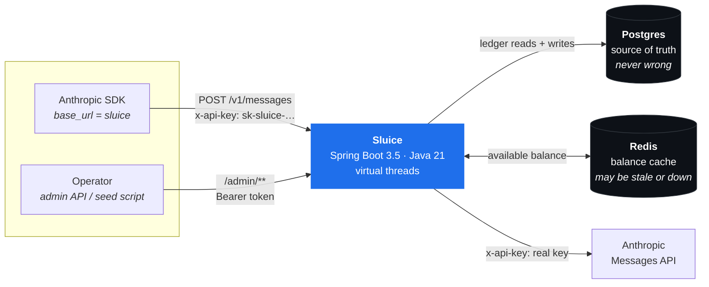
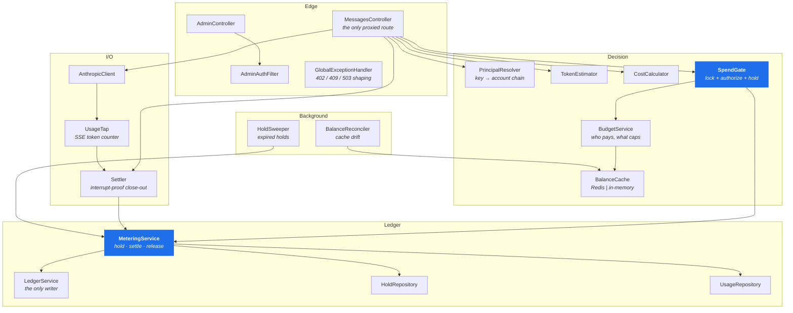
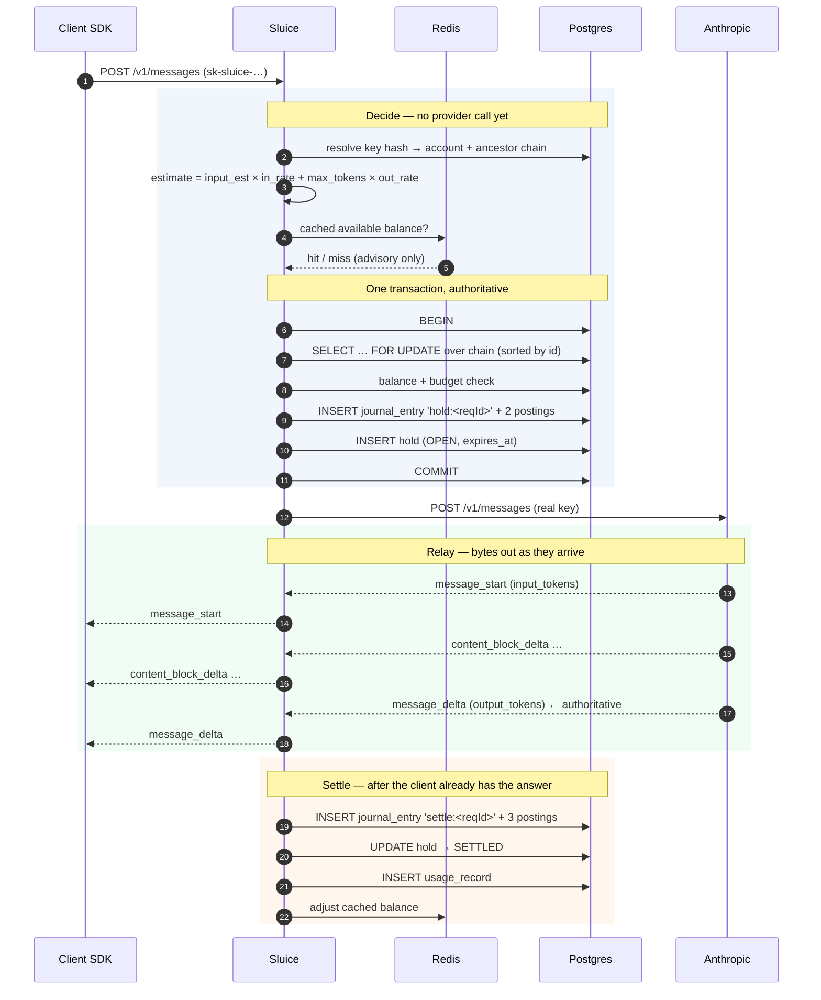
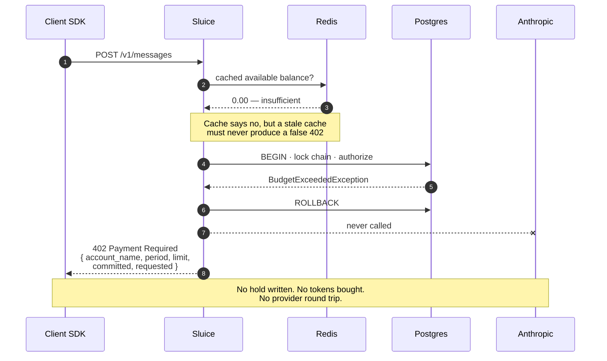
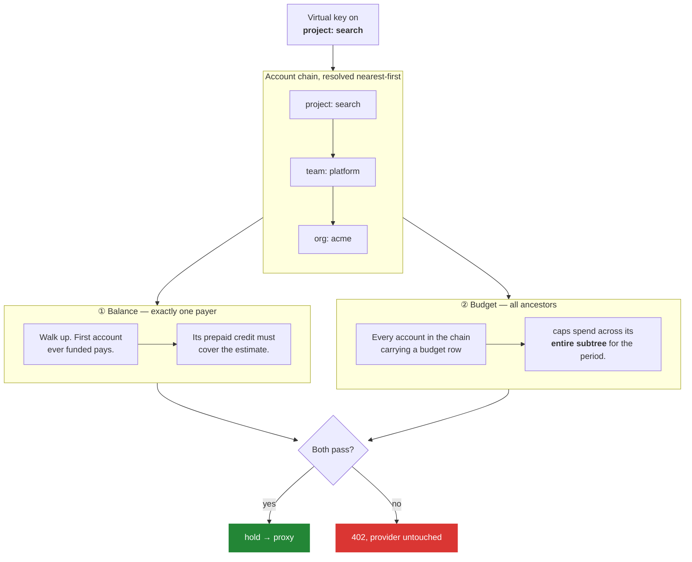
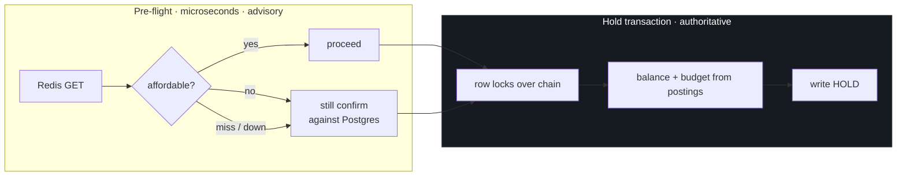
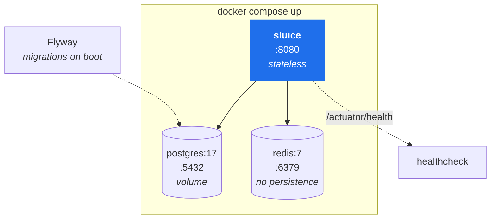

# High-level design

What the system is made of, how a request moves through it, and what happens when
each piece fails.

---

## 1. The problem shape

Three facts constrain every design decision here:

1. **You cannot know what a call costs until it finishes.** Output tokens are priced,
   and output does not exist yet when the allow/deny decision has to be made.
2. **The decision must happen before the call leaves.** Refusing after the fact is
   what a dashboard does. It does not stop spend.
3. **The numbers have to be good enough to invoice from.** A counter that is
   approximately right is fine for a chart and useless for a bill.

(1) and (2) together force a **reserve-then-reconcile** design: block a pessimistic
estimate up front, run the call, replace the estimate with the truth afterwards.
That is the hold/settle cycle, and it is the same mechanism a card network uses when
a fuel pump authorises $100 and settles $43.

(3) forces **double-entry bookkeeping** rather than a `spend_total` column. A counter
cannot tell you *why* a balance is what it is, cannot be audited, and quietly absorbs
every bug that ever touches it.

---

## 2. System context



Integration cost for the caller is one line:

```python
client = Anthropic(base_url="https://sluice.internal", api_key="sk-sluice-...")
```

No SDK fork, no wrapper library, no code change at the call site. That constraint is
what makes the proxy shape the right answer instead of a client-side SDK.

---

## 3. Internal components



Two components carry the weight. **`SpendGate`** decides whether a call may proceed
and who pays for it. **`MeteringService`** is the only thing that moves money.
Everything else feeds one of those two.

---

## 4. Request lifecycle — the allowed path



Note where the transaction boundary sits: **the hold commits before the provider is
contacted.** If the process dies at any point after that, the money is already
reserved and the sweeper will reclaim it. The failure mode is a temporarily
over-reserved account, never an unmetered call.

---

## 5. Request lifecycle — the refused path

This is the path the product exists for.



The refusal names **which account in the chain** tripped and by how much, so a
developer can diagnose it from the client side without admin access. An org-level
budget refusing a project's call says `acme`, not the project's name.

---

## 6. Who pays, and what constrains a call

Two independent constraints. Either can refuse.



**Balance — one payer.** Walking up and stopping at the first funded account means
funding is a placement decision with real meaning:

- Fund the **org** → every project beneath it draws from one shared pot.
- Fund a **project** → it gets a ring-fenced pot nothing else can touch.

Only that account's `credits:` is debited, so a balance never has two competing
interpretations.

**Budget — all ancestors.** Budgets are additive and independent of funding. Spend is
summed across the whole subtree beneath each budgeted account, so a team budget
counts every project under it. This is what lets an unfunded team run on a pure
budget with no prepaid credit at all.

**Neither present?** Refused. An account with no credit and no budget anywhere in its
chain is one nobody can stop spending — the exact failure this gateway exists to
prevent. Override with `sluice.budget.allow-unmetered=true` if you genuinely want it.

---

## 7. Consistency model

> **Postgres is the source of truth and is never wrong. Redis is a cache and may be
> stale, empty, or entirely down.**



The cache can only ever make things **slower**, never wrong:

| Cache state | Effect |
| --- | --- |
| Correct | Cheap early rejection; Postgres agrees. |
| Stale **high** | Pre-flight says yes, the hold transaction refuses. Correct answer, one extra round trip. |
| Stale **low** | Pre-flight says no — so Sluice confirms against Postgres before refusing. No false `402`. |
| Missing | Falls through to Postgres and repopulates. |
| Redis down | Every operation swallows the error, marks the cache unhealthy, and falls through. Correctness unchanged. |

`BalanceReconciler` re-derives cached balances from `posting` on a timer, bounding
drift from lost increments or a second gateway instance.

**Honest note on what the cache buys.** It makes the *refusal* path cheap — a runaway
agent's thousandth rejected call costs a Redis `GET`, not a database round trip. It
does **not** speed up the accept path, which still writes the hold to Postgres
synchronously. Moving settlement behind an outbox is the next step, and is worth
doing when load testing shows it matters, not before.

---

## 8. Failure modes

Availability posture: **fail closed.** Not charging for a call is a bug. Letting
spend run unmetered is a worse bug.

| Failure | Behaviour | Money impact |
| --- | --- | --- |
| **Postgres unreachable** | `503`, provider never called | None. Nothing spent. |
| **Redis unreachable** | Cache marked unhealthy, all checks fall through to Postgres | None. Slower only. |
| **Provider returns 4xx/5xx** | Hold released in full, provider's error relayed verbatim | Nothing charged. |
| **Provider times out** | Hold released, `502` | Nothing charged. |
| **Client disconnects mid-stream** | Upstream cancelled → generation stops. Settled on delivered tokens, `partial=true` | Charged for what was delivered. |
| **Sluice killed mid-call** | Hold is already committed; sweeper releases it after `expires_at` | Reserved briefly, then returned. The call itself goes unbilled. |
| **Settle write fails** | Logged at `ERROR` with full replay detail; sweeper releases the hold | **Call goes unbilled.** The known gap — an outbox would close it. |
| **Actual cost > estimate** | Charged in full; balance may go negative | Correct. Under-reporting spend is the worse failure. |
| **Unknown model** | Hold released, nothing charged, loud log | Unbilled rather than guessed. Add a `model_rate` row. |

---

## 9. Deployment



**Sluice holds no state.** Every durable fact lives in Postgres; the only in-process
state is the balance cache and a payer-resolution hint, both of which are caches that
rebuild themselves. Horizontal scaling is therefore just more containers behind a
load balancer — correctness comes from Postgres row locks, not from there being one
instance.

Redis runs with persistence disabled on purpose. It is a cache; losing it costs
latency, never correctness.

### Scaling characteristics

| Dimension | Behaviour |
| --- | --- |
| Gateway instances | Horizontal. Stateless. Row locks serialise across instances. |
| Concurrent calls per instance | Virtual threads — one blocking relay per call costs almost nothing. |
| Lock contention | Scoped to an account chain. Unrelated accounts never contend; heavy traffic on **one** account serialises at its hold write. |
| `posting` growth | Grows forever by design (it is an audit log). Balances are derived; add periodic snapshots when the derivation gets slow, not before. |
| Redis | Optional. Absent, Sluice runs single-node with an in-process cache. |

---

## 10. What is deliberately not here

| Not built | Why |
| --- | --- |
| **Prompt / completion storage** | Sluice counts and charges. Never seeing message bodies keeps the security story trivial and is a selling point, not a limitation. |
| **Web UI** | The admin API plus `scripts/seed.sh` covers v1. A UI is presentation over an API that already exists. |
| **Multiple providers** | Designed for — `AnthropicClient` is the only provider-aware class, and `model_rate` is keyed by model string. Ships with Anthropic only. |
| **Cost-aware model routing** | The interesting follow-up: with per-model rates and a live ledger, routing on price becomes a policy layer on top of what exists. |
| **Invoicing and payment collection** | The ledger produces numbers correct enough to bill from. Sending the bill is a different product. |

---

Next: **[LLD.md](LLD.md)** for the algorithms and class-level design ·
**[SCHEMA.md](SCHEMA.md)** for the data model.
