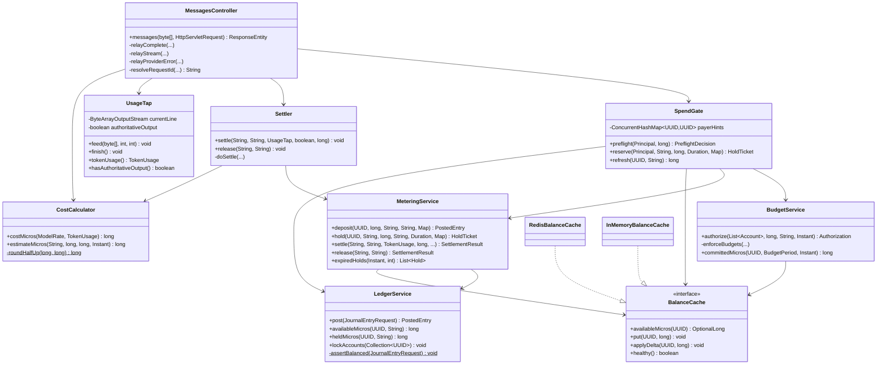
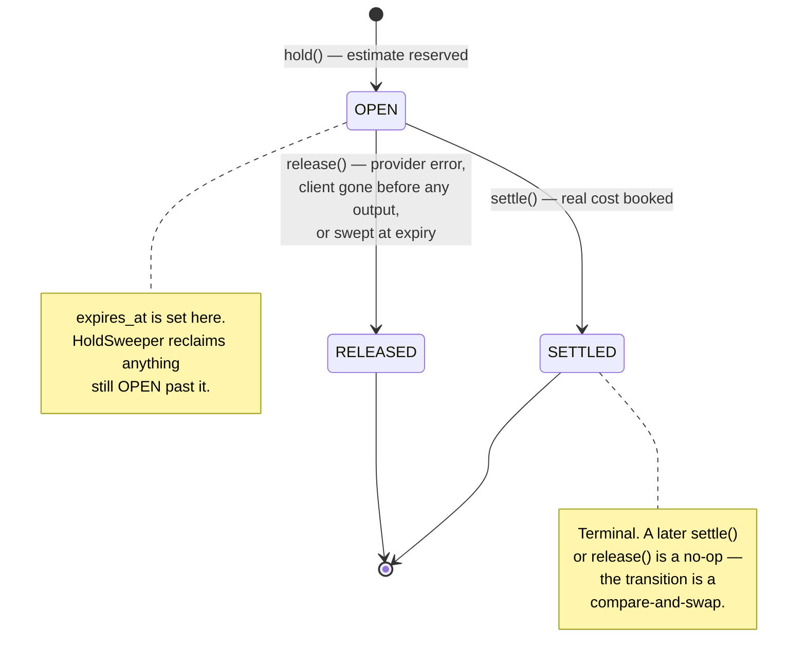
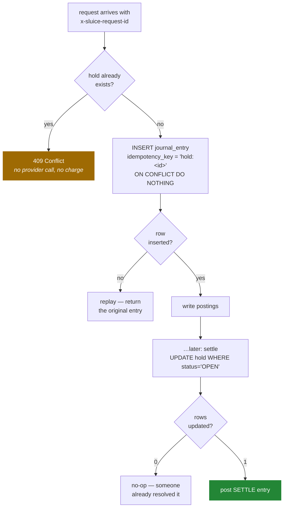
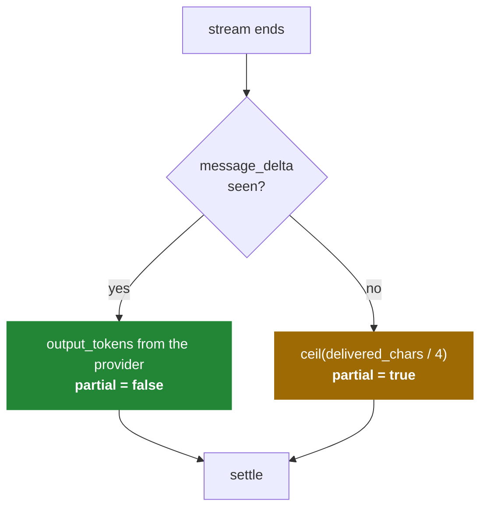
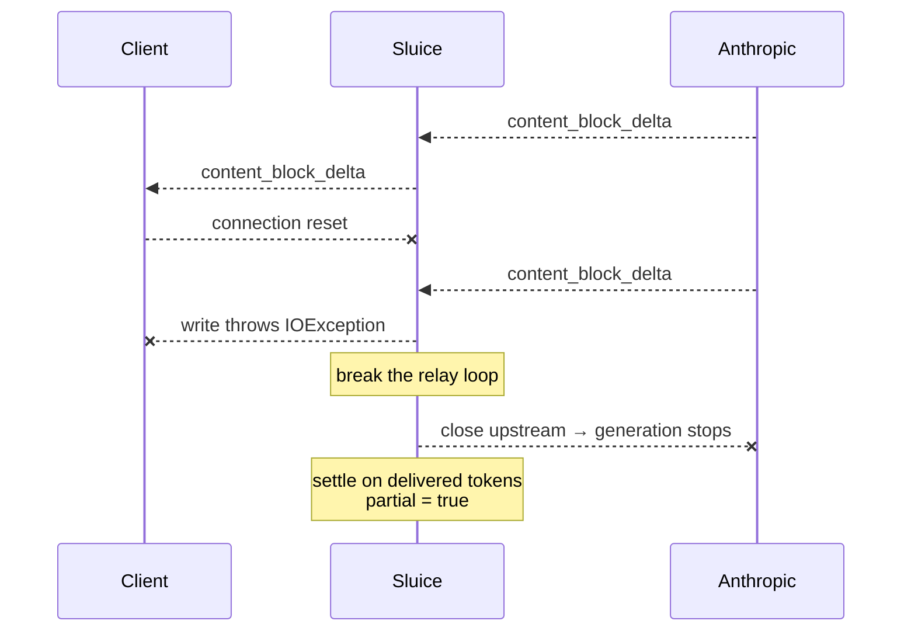

# Low-level design

The algorithms, the class structure, and the reasoning behind the parts that are
easy to get subtly wrong.

---

## 1. Package layout

```
dev.sluice
├── account/    the org → team → project tree, recursive CTE traversal
├── auth/       virtual keys (SHA-256), principal resolution
├── budget/     who pays, what caps, the balance cache, SpendGate
├── ledger/     postings, journal entries, hold/settle/release   ← the core
├── pricing/    model rates, cost arithmetic, pre-flight estimation
├── proxy/      the Anthropic-compatible surface, SSE tap, settlement
├── usage/      usage records and exports
├── sweeper/    expired holds, cache reconciliation
├── admin/      operator API
├── config/     properties, HTTP client, cache wiring
└── web/        error envelope and exception mapping
```

Dependencies point **inward**: `proxy` and `admin` depend on `budget` and `ledger`;
`ledger` depends on nothing but itself. You can delete the entire proxy layer and the
ledger still compiles and still passes its tests.

---

## 2. Class structure



`LedgerService.post` is the **single writer**. No repository that touches `posting` is
exposed to anything above `ledger`. If a new feature needs to move money, it builds a
`JournalEntryRequest` and hands it over — there is no other door.

---

## 3. The hold/settle algebra

Balance is `SUM(DEBIT) − SUM(CREDIT)` for every account. Given that, here is every
entry the system can write.

### Deposit — `$d`

```
DEBIT   credits:P        d
CREDIT  equity:funding   d
```

### Hold — estimate `h`

```
DEBIT   holds:P          h
CREDIT  credits:P        h
```

The pot drops immediately. `available` therefore needs no "minus open holds"
adjustment — it is simply `balance(credits:P)`.

### Settle — hold `h`, actual `a`

Three cases, all of which balance. From
[`MeteringService.settle`](../src/main/java/dev/sluice/ledger/MeteringService.java):

```java
postings.add(credit(holds(payer),   held));              // always: unwind in full
if (actual > 0)   postings.add(debit(usage(payer),   actual));
long difference = held - actual;
if      (difference > 0) postings.add(debit(credits(payer),  difference));
else if (difference < 0) postings.add(credit(credits(payer), -difference));
```

| Case | Postings | Σ debit | Σ credit |
| --- | --- | --- | --- |
| **`a < h`** (normal) | `CREDIT holds h` · `DEBIT usage a` · `DEBIT credits (h−a)` | `a + (h−a) = h` | `h` ✓ |
| **`a = h`** (exact) | `CREDIT holds h` · `DEBIT usage a` | `h` | `h` ✓ |
| **`a > h`** (overrun) | `CREDIT holds h` · `DEBIT usage a` · `CREDIT credits (a−h)` | `a` | `h + (a−h) = a` ✓ |

The third case is a deliberate decision: **the real cost is charged even when it
exceeds the reservation**, driving `credits` negative if it must. The alternative —
capping the charge at the hold — would make the ledger under-report spend that
genuinely happened and that the provider will invoice us for. A negative balance is a
visible, correct problem; a silently absorbed overrun is an invisible, wrong one.

The zero-amount postings are skipped because `posting.amount_micros > 0` is a check
constraint. A posting of zero carries no information and would only weaken the
constraint.

### Release — full reversal

```
DEBIT   credits:P        h
CREDIT  holds:P          h
```

### Hold lifecycle



The transition is guarded in SQL, not in Java:

```sql
update hold set status = ?, resolved_at = now()
 where id = ? and status = 'OPEN'
```

A row count of zero means someone else won. The caller returns
`SettlementResult(created = false)` and writes nothing. This is what makes concurrent
settles safe — `HoldSettleTest.concurrentSettlesChargeOnce` fires sixteen at once and
asserts exactly one wins.

---

## 4. Concurrency: why the lock is where it is

The bug this prevents, with a $100 balance and two concurrent $80 calls:

| Time | Request A | Request B | Ledger |
| --- | --- | --- | --- |
| t1 | read balance → 100 | | 100 |
| t2 | | read balance → 100 | 100 |
| t3 | 100 ≥ 80 → allow | | 100 |
| t4 | | 100 ≥ 80 → allow | 100 |
| t5 | write hold 80 | | 20 |
| t6 | | write hold 80 | **−60** |

Both passed a check only one should have. The fix is to make read-check-write atomic
per account — [`SpendGate.reserve`](../src/main/java/dev/sluice/budget/SpendGate.java):

```java
@Transactional
public HoldTicket reserve(Principal principal, String requestId, long estimateMicros,
                          Duration ttl, Map<String, Object> metadata) {
    ledger.lockAccounts(principal.chainIds());        // ← serialisation point
    Authorization auth = budgets.authorize(principal.chain(), estimateMicros, ...);
    return metering.hold(auth.payer().id(), requestId, estimateMicros, ...);
}
```

With the lock, B blocks at t2 until A commits, then reads 20 and correctly refuses.

### Why locks are taken in sorted order

Two requests over **overlapping but differently ordered** chains would deadlock:

```
Request A (project → org):  lock project … then lock org
Request B (org-level key):  lock org     … then lock project
                            ↑ classic cycle, both wait forever
```

`LedgerRepository.lockAccountsInOrder` sorts by UUID before locking:

```java
accountIds.stream().sorted().forEach(id ->
        jdbc.queryForList("select id from account where id = ? for update", UUID.class, id));
```

A global ordering makes a cycle impossible — every transaction grabs the same locks in
the same sequence, so one always completes.

Locks are held only for the duration of the hold transaction (a few inserts, no
network I/O), and scoped to one account chain. Unrelated accounts never contend.

---

## 5. Idempotency

Three defences, layered:



| Layer | Mechanism | Catches |
| --- | --- | --- |
| Request | `hold` lookup → `409` | A client retrying a call that already ran |
| Entry | `idempotency_key UNIQUE` | Two concurrent writers of the same logical entry |
| Hold | `UPDATE … WHERE status = 'OPEN'` | Settle racing release, or the sweeper |

Key namespacing keeps one call's three steps distinct:

```
hold:req-abc      settle:req-abc      release:req-abc
```

The `409` is worth justifying. Sluice deliberately does not store response bodies, so
it *cannot* replay the original answer. Silently re-running the call would spend money
the caller did not ask to spend twice. Refusing is the only honest option, and the
error says exactly that.

---

## 6. Cost arithmetic

[`CostCalculator`](../src/main/java/dev/sluice/pricing/CostCalculator.java). No
floating point anywhere.

```java
long weighted = 0;
weighted = addExact(weighted, multiplyExact(usage.inputTokens(),  rate.inputPerMTokMicros()));
weighted = addExact(weighted, multiplyExact(usage.outputTokens(), rate.outputPerMTokMicros()));
weighted = addExact(weighted, multiplyExact(usage.cacheCreationInputTokens(), rate.cacheWritePerMTokMicros()));
weighted = addExact(weighted, multiplyExact(usage.cacheReadInputTokens(),     rate.cacheReadPerMTokMicros()));
return roundHalfUp(weighted, 1_000_000L);
```

**Overflow is bounded.** Worst realistic case is ~1M tokens × 50,000,000 micros/MTok
≈ 5 × 10¹³, four orders of magnitude below `Long.MAX_VALUE`. `multiplyExact` /
`addExact` throw rather than wrap, so a rate-table typo surfaces as an exception
instead of a negative charge.

**Rounding is half-up and deterministic**, applied once at the end rather than
per-term, so the result never depends on the order the terms were summed:

```java
long quotient = numerator / denominator;
if (numerator % denominator * 2 >= denominator) quotient++;
```

### Pre-flight estimation

```
estimate = (estimated_input_tokens × input_rate)
         + (max_tokens            × output_rate)
```

Two deliberate pessimisms:

1. **Every input token priced as uncached.** Cache reads are ~10× cheaper, so assuming
   no cache hits over-reserves. Safe direction.
2. **Full `max_tokens` of output.** Most calls emit a fraction of it.

`TokenEstimator` walks the request JSON summing string lengths at ~3.5 chars/token,
plus per-message envelope overhead, with a floor of 16 tokens. It never calls the
provider's `count_tokens` endpoint — that would add a network round trip to every
request to sharpen a number that gets replaced at settle time anyway.

The estimate only sizes the hold. Accuracy is not the goal; **never under-reserving**
is. An estimate that is too small lets spend escape the budget.

---

## 7. Streaming: counting without touching the bytes

Two constraints in tension: the response must be relayed **byte-for-byte** (so
features Sluice has never heard of keep working), and tokens must be counted from it.

[`UsageTap`](../src/main/java/dev/sluice/proxy/UsageTap.java) resolves this by never
parsing the stream as a stream — it accumulates one line at a time while the raw bytes
go straight out:

```java
while ((read = in.read(buffer)) != -1) {
    tap.feed(buffer, 0, read);      // counts
    out.write(buffer, 0, read);     // relays — same bytes, untouched
    out.flush();                    // time-to-first-token is a copy loop
}
```

`feed()` scans for `\n`, buffering only the current line. Chunk boundaries land
wherever the network puts them, so the tap must be indifferent to them —
`UsageTapTest.isIndifferentToChunkBoundaries` replays the same stream at 1, 3, 7, 64
and 512 bytes per chunk and asserts identical results.

### Which events matter

| SSE event | Read |
| --- | --- |
| `message_start` | `input_tokens`, cache read/write split, `model` |
| `content_block_delta` | length of `text` / `partial_json` / `thinking` — the partial-stream fallback |
| `message_delta` | **`output_tokens` — authoritative, arrives last** |
| everything else | ignored |

### Authoritative vs. estimated output



Sluice trusts the provider's own count over anything it could derive, because the
provider's count is what we get invoiced for. The fallback exists only for streams
that die early, and it marks the usage row `partial` so anything downstream knows the
number is an estimate.

An unparseable line is skipped, never fatal — a malformed SSE frame is not a reason to
fail a customer's call.

---

## 8. Client disconnect



**Cancelling upstream is the point.** Draining the rest of the response would keep the
provider generating tokens nobody will ever read — and billing us for them. Closing
the connection stops generation at the source.

### The interrupt trap

A subtle failure this design walks straight into, and the reason
[`Settler`](../src/main/java/dev/sluice/proxy/Settler.java) looks the way it does:

> When a client disconnects, the servlet container **interrupts** the request thread.
> JDBC over NIO closes its socket the instant it touches an interrupted thread. So the
> settle triggered *by* the disconnect fails with
> `SocketException: Closed by interrupt` — and the call is silently never billed.

```java
public void settle(String requestId, String requestedModel, UsageTap tap,
                   boolean streamed, long startedAtNanos) {
    boolean interrupted = Thread.interrupted();   // clears the flag
    try {
        doSettle(requestId, requestedModel, tap, streamed, startedAtNanos);
    } finally {
        if (interrupted) {
            Thread.currentThread().interrupt();   // restore for the container
        }
    }
}
```

This was found by `ProxyIntegrationTest.clientDisconnectSettlesPartially`, which opens
a raw socket, reads part of the stream, sets `SO_LINGER 0` and yanks it. Reading the
code would never have surfaced it.

Settlement also never propagates a failure into the response — by the time it runs, the
client usually already has their answer. A failed settle is logged at `ERROR` with
everything needed to replay it, and the hold is left for the sweeper.

---

## 9. Background jobs

### `HoldSweeper`

```sql
select * from hold
 where status = 'OPEN' and expires_at < now()
 order by expires_at limit ?
```

Backed by the partial index `hold (expires_at) where status = 'OPEN'`, so the query
cost tracks the number of *stuck* holds, not the size of the table.

Each is released through the normal `MeteringService.release` path — same
compare-and-swap, same journal entry — so a hold that settles concurrently with a
sweep resolves exactly once.

TTL defaults to 15 minutes, deliberately longer than any plausible completion.
Releasing early would under-reserve a live call; releasing late costs only temporarily
reserved money. Wrong in the safe direction.

### `BalanceReconciler`

Re-derives cached balances from `posting` for every funded account on a timer. The
cache is maintained incrementally in the request path (`applyDelta`), which is fast but
drifts — a lost Redis increment, or another gateway instance posting entries this one
never saw. This puts it back.

Skipped entirely when the cache reports unhealthy; there is nothing to reconcile into a
cache that is down.

---

## 10. Error mapping

[`GlobalExceptionHandler`](../src/main/java/dev/sluice/web/GlobalExceptionHandler.java).
Errors mirror the provider's envelope so existing client error handling keeps working,
with a `sluice` block added for the detail that makes a refusal debuggable.

| Exception | Status | Meaning |
| --- | --- | --- |
| `BudgetExceededException` | **402** | Budget or balance. Names the account, period, limit, committed, requested. |
| `UnmeteredAccountException` | **402** | No credit and no budget anywhere in the chain. |
| `UnauthorizedException` | 401 | Unknown or revoked virtual key. |
| `DuplicateRequestException` | 409 | Request id already processed. |
| `InvalidRequestException` | 400 | Missing `model`, bad `max_tokens`, malformed JSON. |
| `UnknownModelException` | 400 | No `model_rate` row — Sluice will not guess a price. |
| `ProviderException` | 502 | Upstream unreachable. Hold already released. |
| `DataAccessException` | **503** | Ledger unavailable. **Fail closed.** |

```json
{
  "type": "error",
  "error": {
    "type": "payment_required",
    "message": "MONTHLY budget exceeded on account 'platform': limit 5.000000 USD, 5.000000 USD already committed, 0.030000 USD requested",
    "sluice": {
      "reason": "budget_exceeded",
      "account_id": "…", "account_name": "platform",
      "period": "MONTHLY",
      "limit": "5.000000", "committed": "5.000000", "requested": "0.030000",
      "currency": "USD"
    }
  }
}
```

---

## 11. Test strategy

54 tests, no Docker required. They run against a **real embedded Postgres**
(`io.zonky.test:embedded-postgres`) because the guarantees under test — a deferred
constraint trigger, a unique index, `SELECT … FOR UPDATE` — are enforced by Postgres
itself. An in-memory database in "PostgreSQL compatibility mode" would test the
emulation rather than the thing that ships.

| Test | Proves |
| --- | --- |
| `LedgerConcurrencyTest` | 1,000 concurrent transfers; invariant holds three ways. Raw SQL cannot commit an unbalanced entry. |
| `HoldSettleTest` | Hold/settle/release arithmetic, replay safety, 16 concurrent settles → one charge, overrun charged in full. |
| `ProxyIntegrationTest` | Verbatim relay, key substitution, replay → 409, provider error → release, streaming, mid-stream disconnect. |
| `BudgetEnforcementTest` | $5 budget refuses at $5.01 with the provider never called; ancestor budgets; soft budgets; concurrent calls cannot collectively overrun. |
| `HoldSweeperTest` | Expired holds released, live holds untouched, sweep idempotent. |
| `UsageTapTest` | Chunk-boundary indifference, truncated streams, malformed frames. |
| `CostCalculatorTest` | Sub-cent precision survives, half-up rounding, unknown model rejected. |
| `GatewayOverheadTest` | Latency measurement, guarding against order-of-magnitude regressions. |
| `AdminApiTest` | Zero-to-metered-call over HTTP, idempotent credits, revocation. |

The stand-in provider (`FakeAnthropic`) is a real HTTP server on a real socket, so
header handling, chunked streaming and disconnects are exercised end to end without a
network call or an API key.

---

Back to **[HLD.md](HLD.md)** · **[SCHEMA.md](SCHEMA.md)**
