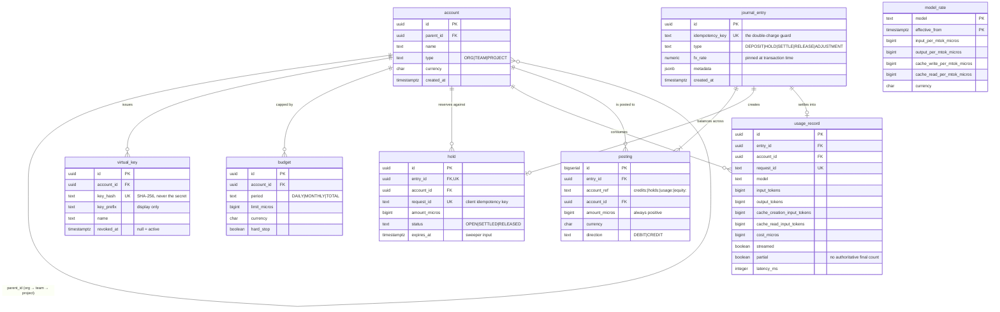

# Data model

Nine tables. Four of them are the ledger; the rest are the things that hang off it.

Every constraint below is load-bearing — each one is the *only* thing standing
between a bug and a wrong number on an invoice. Where a constraint exists because
the application cannot be trusted to enforce it, that is stated explicitly.

---

## Entity relationships



---

## Money is stored in micros

**1 currency unit = 1,000,000 micros.**

Minor units (cents) are too coarse for LLM billing. A 300-token call on a $3/MTok
model costs $0.0009 — which rounds to **zero cents**. Bill a million of those and
you have charged nothing.

Micros give six decimal places. A signed `BIGINT` still spans roughly ±$9.2
trillion, so overflow is not a practical concern. All arithmetic is exact integer
math (`Math.multiplyExact`, `Math.addExact`) with a single half-up division at the
very end — see [`CostCalculator`](../src/main/java/dev/sluice/pricing/CostCalculator.java).

Floating point is never used for money anywhere in the system.

---

## The ledger tables

### `journal_entry` — the transaction header

```sql
create table journal_entry (
    id               uuid        primary key,
    idempotency_key  text        not null unique,
    type             text        not null check (type in
                                 ('DEPOSIT', 'HOLD', 'SETTLE', 'RELEASE', 'ADJUSTMENT')),
    fx_rate          numeric(24, 12) not null default 1 check (fx_rate > 0),
    metadata         jsonb       not null default '{}'::jsonb,
    created_at       timestamptz not null default now()
);
```

| Column | Why it exists |
| --- | --- |
| `idempotency_key` | **`UNIQUE` is the entire double-charge defence.** The application inserts with `ON CONFLICT DO NOTHING` and treats "no row returned" as a replay. Two concurrent identical settles: one inserts, the other blocks, then finds the conflict and no-ops. The database arbitrates, not the application. |
| `fx_rate` | Pinned **at transaction time**. Historical balances must never drift when today's rate moves, so amounts are never re-derived from a current rate. |
| `metadata` | Request id, model, token counts, stop reason. Enough to reconstruct why an entry exists during an audit. Never prompt or completion text. |

Key formats — one namespace per lifecycle step, all derived from the client's
request id, so the three steps of one call can never collide:

```
hold:<requestId>       settle:<requestId>      release:<requestId>
deposit:<reference>    (operator-supplied, so a retried top-up is not free money)
```

### `posting` — the transaction lines

```sql
create table posting (
    id             bigserial   primary key,
    entry_id       uuid        not null references journal_entry (id),
    account_ref    text        not null,
    account_id     uuid        references account (id),
    amount_micros  bigint      not null check (amount_micros > 0),
    currency       char(3)     not null,
    direction      text        not null check (direction in ('DEBIT', 'CREDIT'))
);
```

`amount_micros` is **always positive**; the sign lives entirely in `direction`.
This is what makes the balance rule uniform — see below.

`account_ref` namespaces four ledger accounts onto each customer account:

| `account_ref` | Meaning | Normal balance |
| --- | --- | --- |
| `credits:<uuid>` | Spendable prepaid pot | positive |
| `holds:<uuid>` | Reserved for calls in flight | positive |
| `usage:<uuid>` | Lifetime consumption | positive |
| `equity:funding` | Contra account money enters through | negative |

`equity:funding` has a `NULL` `account_id` — it belongs to the house, not to a
customer.

### One balance rule, universally

```
balance(account) = SUM(amount WHERE direction = 'DEBIT')
                 − SUM(amount WHERE direction = 'CREDIT')
```

Applied to **every** account, with no per-account-type exceptions. Two consequences
worth stating plainly:

1. **The entire ledger sums to exactly zero**, always. The integrity check is one
   `SELECT` over `posting` with no joins and no grouping.
2. `available` for an account is just `balance(credits:<id>)` — a single number.
   No "minus open holds" arithmetic, because a hold already debited it out.

### The invariant, enforced by Postgres

```sql
create or replace function assert_entry_balanced() returns trigger as $$
declare
    target uuid := coalesce(new.entry_id, old.entry_id);
    offending record;
begin
    select currency,
           sum(case when direction = 'DEBIT'  then amount_micros else 0 end) as debits,
           sum(case when direction = 'CREDIT' then amount_micros else 0 end) as credits
      into offending
      from posting
     where entry_id = target
     group by currency
    having sum(case when direction = 'DEBIT'  then amount_micros else 0 end)
        <> sum(case when direction = 'CREDIT' then amount_micros else 0 end)
     limit 1;

    if found then
        raise exception 'journal entry % is unbalanced in %: debits=% credits=%',
            target, offending.currency, offending.debits, offending.credits
            using errcode = 'check_violation';
    end if;
    return null;
end;
$$ language plpgsql;

create constraint trigger posting_balanced
    after insert or update or delete on posting
    deferrable initially deferred
    for each row execute function assert_entry_balanced();
```

**`DEFERRABLE INITIALLY DEFERRED` is the important part.** A journal entry is
written as several `INSERT`s, so it is legitimately unbalanced *between* them.
Deferring the check to `COMMIT` allows that, while making it impossible to commit
an unbalanced entry — **through any code path**, including raw SQL that bypasses
the application entirely.

`LedgerConcurrencyTest.databaseRefusesUnbalancedPostings` opens a transaction, writes
a one-sided posting with hand-written SQL, and asserts the commit fails.

Grouping by `currency` means an entry that is balanced in USD but not in EUR is
still rejected.

---

## Operational tables

### `account` — the cost-centre tree

```sql
create table account (
    id          uuid        primary key,
    parent_id   uuid        references account (id),
    name        text        not null,
    type        text        not null check (type in ('ORG', 'TEAM', 'PROJECT')),
    currency    char(3)     not null,
    created_at  timestamptz not null default now()
);

create index account_parent_idx on account (parent_id);
alter table account add constraint account_not_self_parent
    check (parent_id is distinct from id);
```

Self-parenting is blocked by a check constraint; longer cycles are prevented in the
application by walking the chain before insert. Traversal is a recursive CTE in both
directions — `chain()` walks up (for budget checks), `subtreeIds()` walks down (for
usage rollups).

### `virtual_key`

```sql
create table virtual_key (
    id          uuid        primary key,
    account_id  uuid        not null references account (id),
    key_hash    text        not null unique,
    key_prefix  text        not null,
    name        text        not null,
    created_at  timestamptz not null default now(),
    revoked_at  timestamptz
);
```

**The secret is never stored.** `key_hash` is SHA-256 hex of the presented key, and
lookup hashes the incoming value and matches on the unique index. `key_prefix` holds
the first few characters purely so an operator can tell keys apart in a listing.

Revocation is `revoked_at IS NOT NULL` rather than a delete, so a revoked key's
historical usage still resolves to its account.

### `budget`

```sql
create table budget (
    id            uuid        primary key,
    account_id    uuid        not null references account (id),
    period        text        not null check (period in ('DAILY', 'MONTHLY', 'TOTAL')),
    limit_micros  bigint      not null check (limit_micros >= 0),
    currency      char(3)     not null,
    hard_stop     boolean     not null default true,
    created_at    timestamptz not null default now(),
    updated_at    timestamptz not null default now(),
    unique (account_id, period)
);
```

`UNIQUE (account_id, period)` makes `PUT /budget` a genuine upsert — one daily and
one monthly limit per account, never a duplicate pair that both half-apply.

`hard_stop = false` records the breach and lets the call through: the alert without
the outage.

Periods roll over at **UTC midnight** so a budget means the same thing regardless of
where the team sits.

### `hold`

```sql
create table hold (
    id             uuid        primary key,
    entry_id       uuid        not null unique references journal_entry (id),
    account_id     uuid        not null references account (id),
    request_id     text        not null unique,
    amount_micros  bigint      not null check (amount_micros > 0),
    currency       char(3)     not null,
    status         text        not null check (status in ('OPEN', 'SETTLED', 'RELEASED')),
    created_at     timestamptz not null default now(),
    expires_at     timestamptz not null,
    resolved_at    timestamptz
);

create index hold_open_expiry_idx on hold (expires_at) where status = 'OPEN';
create index hold_account_idx on hold (account_id);
```

| Constraint | Why |
| --- | --- |
| `request_id UNIQUE` | A second hold for the same call is impossible at the storage layer. |
| `entry_id UNIQUE` | One hold per journal entry — no two holds sharing a reservation. |
| `hold_open_expiry_idx` | **Partial index.** The sweeper only ever asks for `OPEN` holds past expiry, so resolved holds — eventually the overwhelming majority — are not in the index at all. It stays small as the table grows without bound. |

Status transitions are one-way and guarded by the update itself:

```sql
update hold set status = ?, resolved_at = now() where id = ? and status = 'OPEN'
```

The `and status = 'OPEN'` clause makes the transition a compare-and-swap. A zero row
count means someone else resolved it first, and the caller must not post anything.

### `usage_record`

```sql
create table usage_record (
    id                           uuid        primary key,
    entry_id                     uuid        not null references journal_entry (id),
    account_id                   uuid        not null references account (id),
    request_id                   text        not null unique,
    model                        text        not null,
    input_tokens                 bigint      not null default 0,
    output_tokens                bigint      not null default 0,
    cache_creation_input_tokens  bigint      not null default 0,
    cache_read_input_tokens      bigint      not null default 0,
    cost_micros                  bigint      not null,
    currency                     char(3)     not null,
    streamed                     boolean     not null default false,
    partial                      boolean     not null default false,
    latency_ms                   integer     not null default 0,
    created_at                   timestamptz not null default now()
);

create index usage_account_created_idx on usage_record (account_id, created_at);
```

The billing-grade fact table: one row per settled call, with the provider's own
token counts, split by cache tier because the tiers are priced differently.

`partial = true` means the stream ended before the provider reported a final count,
so the charge is based on delivered output. Worth surfacing on any invoice derived
from this table.

`(account_id, created_at)` is the index every budget window query and every usage
export uses.

### `model_rate`

```sql
create table model_rate (
    model                        text        not null,
    input_per_mtok_micros        bigint      not null check (input_per_mtok_micros >= 0),
    output_per_mtok_micros       bigint      not null check (output_per_mtok_micros >= 0),
    cache_write_per_mtok_micros  bigint      not null check (cache_write_per_mtok_micros >= 0),
    cache_read_per_mtok_micros   bigint      not null check (cache_read_per_mtok_micros >= 0),
    currency                     char(3)     not null default 'USD',
    effective_from               timestamptz not null default timestamptz '1970-01-01 00:00:00Z',
    primary key (model, effective_from)
);
```

**Rates are versioned in time, and rows are never updated.** A price change is a new
row with a later `effective_from`. Lookup takes the most recent row at or before the
moment in question:

```sql
select * from model_rate
 where model = ? and effective_from <= ?
 order by effective_from desc limit 1
```

This is what makes historical usage reproducible: re-running a report for last
quarter uses last quarter's prices, not today's. `UPDATE` on this table silently
rewrites history and should be treated as a bug.

Seeded rates are in
[`V2__seed_model_rates.sql`](../src/main/resources/db/migration/V2__seed_model_rates.sql),
expressed as micros per million tokens ($5.00/MTok = `5000000`).

---

## One call, traced through the tables

A $25 top-up followed by a single call: estimate $0.05, actual cost $0.0175.

**1. Deposit**

| table | row |
| --- | --- |
| `journal_entry` | `idempotency_key='deposit:invoice-1'`, `type=DEPOSIT` |
| `posting` | `DEBIT  credits:<team>  25000000` |
| `posting` | `CREDIT equity:funding 25000000` |

`balance(credits) = 25000000` → **$25.00 available**

**2. Hold** (pre-flight estimate: input tokens + full `max_tokens` of output)

| table | row |
| --- | --- |
| `journal_entry` | `idempotency_key='hold:req-abc'`, `type=HOLD` |
| `posting` | `DEBIT  holds:<team>   50000` |
| `posting` | `CREDIT credits:<team> 50000` |
| `hold` | `request_id='req-abc'`, `status=OPEN`, `expires_at=now()+15m` |

`balance(credits) = 24950000` → **$24.95 available**, $0.05 reserved

**3. Settle** (provider reported 1000 input + 500 output = $0.0175)

| table | row |
| --- | --- |
| `journal_entry` | `idempotency_key='settle:req-abc'`, `type=SETTLE` |
| `posting` | `CREDIT holds:<team>   50000` ← reservation unwound in full |
| `posting` | `DEBIT  usage:<team>   17500` ← real cost booked |
| `posting` | `DEBIT  credits:<team> 32500` ← unused remainder returned |
| `hold` | `status=SETTLED`, `resolved_at=now()` |
| `usage_record` | tokens, `cost_micros=17500`, `latency_ms`, `partial=false` |

Debits `50000`, credits `50000`. Balanced. ✓

**Final state**

```
credits:<team>   24982500   →  $24.9825 available
holds:<team>            0   →  nothing reserved
usage:<team>        17500   →  $0.0175 consumed
equity:funding  -25000000
────────────────────────────
total                   0   ←  the invariant
```

---

## Migrations

Flyway, at `src/main/resources/db/migration`:

| File | Contents |
| --- | --- |
| `V1__baseline.sql` | All nine tables, indexes, constraints, and the balance trigger |
| `V2__seed_model_rates.sql` | Published rates for the current model lineup |

Migrations run automatically on startup. Never edit an applied migration — add a new
one, so every environment converges through the same sequence.
